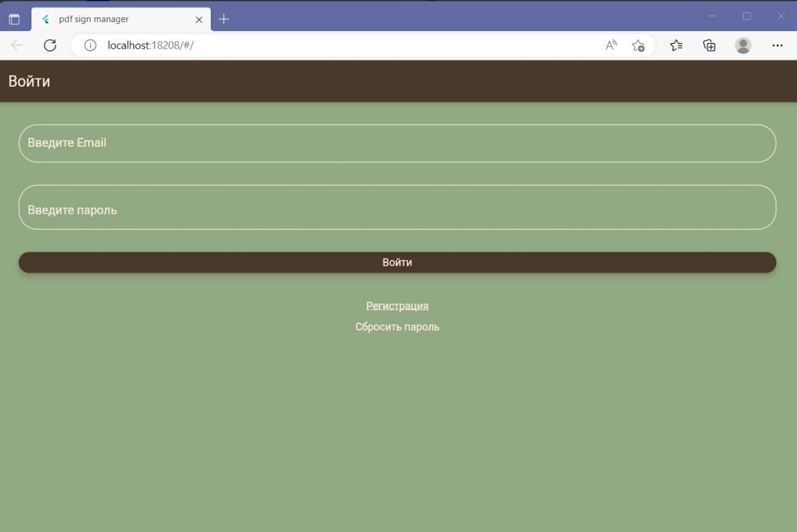
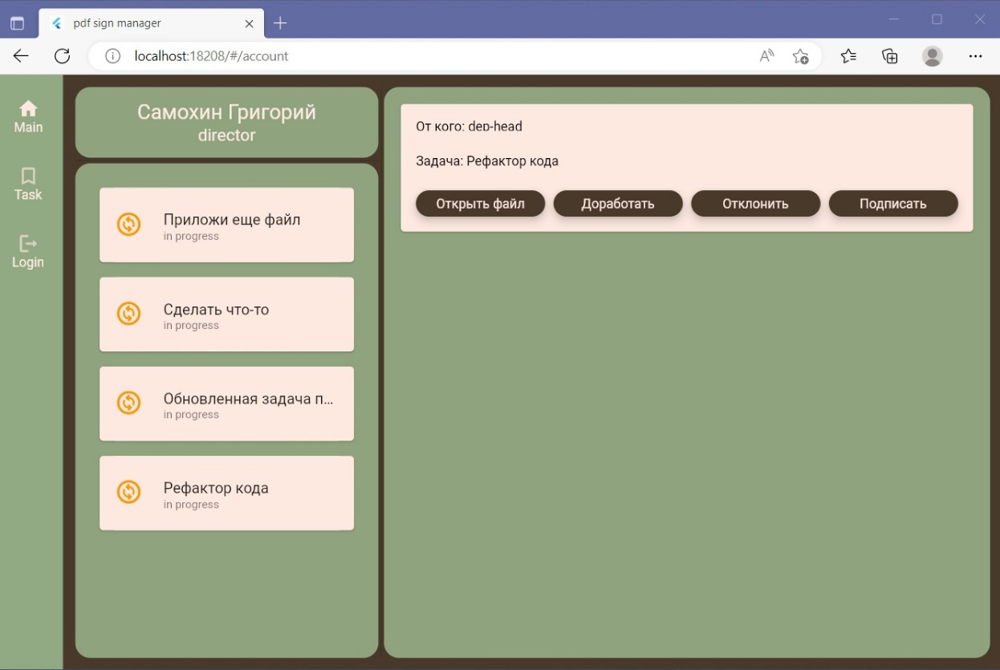

# pdf-sign-manager

Project for course work. An application for document management with the functions of uploading, signing and downloading various documents. Multiple registered users can work at the same time.

<b> Current features:</b> 
<ul>
<li><b>Authorization and registration; </b> 
<li><b>Create tasks for employees lower in position; </b> 
<li><b>Attach a file to a task; </b> 
<li><b>Sign and send the file to the customer; </b>  
</ul>

 

